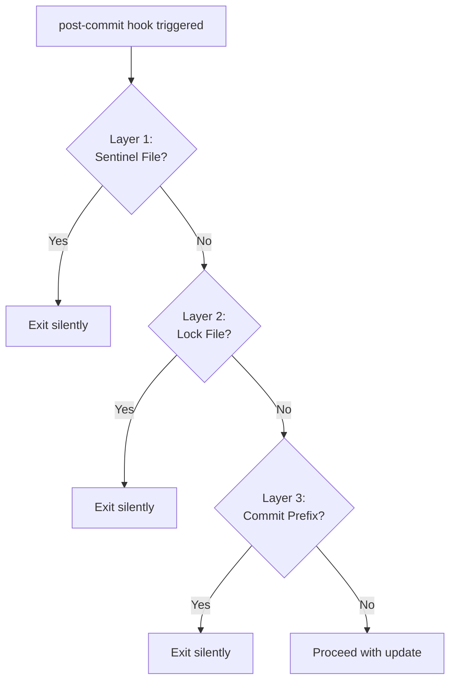
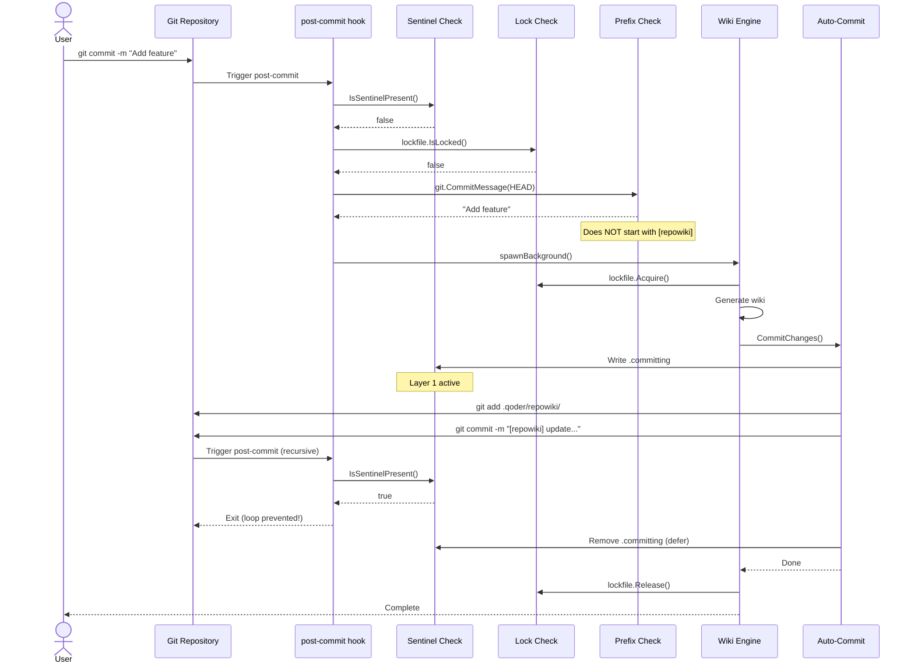

# Loop Prevention

<cite>
Source files referenced:
- [cmd/repowiki/hooks.go](/to/cmd/repowiki/hooks.go)
- [internal/wiki/commit.go](/to/internal/wiki/commit.go)
- [internal/lockfile/lockfile.go](/to/internal/lockfile/lockfile.go)
</cite>

## Table of Contents

- [The Problem](#the-problem)
- [Three-Layer Defense](#three-layer-defense)
- [Layer 1: Sentinel File](#layer-1-sentinel-file)
- [Layer 2: Lock File](#layer-2-lock-file)
- [Layer 3: Commit Prefix](#layer-3-commit-prefix)
- [Flow Diagram](#flow-diagram)

## The Problem

When repowiki auto-commits wiki changes, those commits could trigger the post-commit hook again, creating an infinite loop:

```
User commits → Hook triggers → Wiki updates → Wiki commits → 
    ↑_________________________________________________________↓
                        (infinite loop)
```

To prevent this, repowiki implements a three-layer defense system.

## Three-Layer Defense



## Layer 1: Sentinel File

**Purpose**: Prevent recursion during the wiki commit phase.

**Location**: `.repowiki/.committing`

**Implementation**:

```go
// internal/wiki/commit.go
const sentinelFile = ".committing"

func sentinelPath(gitRoot string) string {
    return filepath.Join(config.Dir(gitRoot), sentinelFile)
}

// Check if sentinel exists
func IsSentinelPresent(gitRoot string) bool {
    _, err := os.Stat(sentinelPath(gitRoot))
    return err == nil
}

// Write sentinel before committing
func CommitChanges(gitRoot string, cfg *config.Config, description string) error {
    // ...
    sp := sentinelPath(gitRoot)
    if err := os.WriteFile(sp, []byte(strconv.Itoa(os.Getpid())), 0644); err != nil {
        return fmt.Errorf("failed to write sentinel: %w", err)
    }
    defer os.Remove(sp)  // Always clean up
    // ... perform commit ...
}
```

**Hook Check**:

```go
// cmd/repowiki/hooks.go
func handleHooks(args []string) {
    // ...
    // Loop prevention layer 1: sentinel file
    if wiki.IsSentinelPresent(gitRoot) {
        return  // Exit silently - we're in the middle of a wiki commit
    }
    // ...
}
```

**Lifecycle**:
1. Wiki generation starts
2. Before committing, sentinel file is created
3. Commit is performed
4. Sentinel file is deleted (via `defer`)
5. If hook fires during step 3, it sees the sentinel and exits

## Layer 2: Lock File

**Purpose**: Prevent concurrent wiki processes from interfering with each other.

**Location**: `.repowiki/.repowiki.lock`

**Implementation**:

```go
// internal/lockfile/lockfile.go
const lockFileName = ".repowiki.lock"

func Acquire(gitRoot string) error {
    lp := lockPath(gitRoot)

    // Check for stale lock first
    if IsLocked(gitRoot) {
        if isStale(lp) {
            os.Remove(lp)
        } else {
            return fmt.Errorf("another repowiki process is running")
        }
    }

    // Create exclusive lock file
    f, err := os.OpenFile(lp, os.O_CREATE|os.O_EXCL|os.O_WRONLY, 0644)
    if err != nil {
        if os.IsExist(err) {
            return fmt.Errorf("another repowiki process is running")
        }
        return fmt.Errorf("failed to create lock: %w", err)
    }
    defer f.Close()

    // Write PID and timestamp for stale detection
    fmt.Fprintf(f, "%d\n%s\n", os.Getpid(), time.Now().UTC().Format(time.RFC3339))
    return nil
}

func Release(gitRoot string) {
    os.Remove(lockPath(gitRoot))
}

func IsLocked(gitRoot string) bool {
    _, err := os.Stat(lockPath(gitRoot))
    return err == nil
}
```

**Stale Lock Detection**:

```go
func isStale(lp string) bool {
    data, err := os.ReadFile(lp)
    if err != nil {
        return true
    }

    lines := strings.SplitN(string(data), "\n", 3)
    if len(lines) < 1 {
        return true
    }

    // Check if PID is still running
    pid, err := strconv.Atoi(strings.TrimSpace(lines[0]))
    if err != nil {
        return true
    }

    proc, err := os.FindProcess(pid)
    if err != nil {
        return true
    }

    // Send signal 0 to check process (Unix only)
    err = proc.Signal(os.Signal(nil))
    if err != nil {
        return true
    }

    // Check age - stale if older than 30 minutes
    if len(lines) >= 2 {
        ts, err := time.Parse(time.RFC3339, strings.TrimSpace(lines[1]))
        if err == nil && time.Since(ts) > 30*time.Minute {
            return true
        }
    }

    return false
}
```

**Hook Check**:

```go
// cmd/repowiki/hooks.go
func handleHooks(args []string) {
    // ...
    // Loop prevention layer 2: lock file
    if lockfile.IsLocked(gitRoot) {
        return  // Another process is running
    }
    // ...
}
```

**Usage in Wiki Generation**:

```go
// internal/wiki/wiki.go
func FullGenerate(gitRoot string, cfg *config.Config) error {
    if err := lockfile.Acquire(gitRoot); err != nil {
        return fmt.Errorf("cannot acquire lock: %w", err)
    }
    defer lockfile.Release(gitRoot)
    // ... perform generation ...
}
```

## Layer 3: Commit Prefix

**Purpose**: Skip wiki commits that are already identified as repowiki-generated.

**Prefix**: `[repowiki]` (configurable)

**Implementation**:

```go
// cmd/repowiki/hooks.go
func handleHooks(args []string) {
    // ...
    // Load config
    cfg, err := config.Load(gitRoot)
    if err != nil || !cfg.Enabled {
        return
    }

    // Get current commit
    commitHash, err := git.HeadCommit(gitRoot)
    if err != nil {
        return
    }

    // Loop prevention layer 3: check commit message prefix
    commitMsg, err := git.CommitMessage(gitRoot, commitHash)
    if err != nil {
        return
    }
    if strings.HasPrefix(strings.TrimSpace(commitMsg), cfg.CommitPrefix) {
        return  // This is a wiki commit, skip it
    }
    // ... proceed with update ...
}
```

**Commit Creation**:

```go
// internal/wiki/commit.go
func CommitChanges(gitRoot string, cfg *config.Config, description string) error {
    // ...
    // Commit with recognizable prefix
    message := fmt.Sprintf("%s %s", cfg.CommitPrefix, description)
    if err := git.Commit(gitRoot, message); err != nil {
        return fmt.Errorf("failed to commit wiki: %w", err)
    }
    return nil
}
```

**Example Commit Messages**:

```
[repowiki] full wiki generation
[repowiki] update wiki for 5 changed files
```

## Flow Diagram

Complete flow showing all three layers in action:



## Summary

| Layer | Mechanism | Timing | Purpose |
|-------|-----------|--------|---------|
| 1 | Sentinel File | During commit | Prevent recursion during wiki commit |
| 2 | Lock File | During entire operation | Prevent concurrent processes |
| 3 | Commit Prefix | At hook entry | Skip already-processed wiki commits |

These three layers work together to ensure that:
- Wiki commits never trigger themselves
- Concurrent operations don't corrupt state
- The system is resilient to crashes and interruptions
