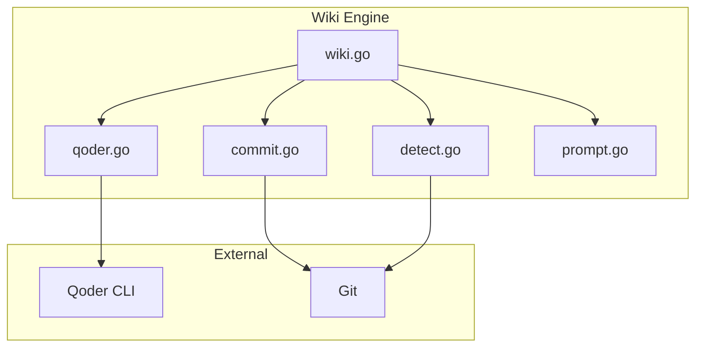

# Wiki Engine

<cite>
Source files referenced:
- [internal/wiki/wiki.go](/to/internal/wiki/wiki.go)
- [internal/wiki/qoder.go](/to/internal/wiki/qoder.go)
- [internal/wiki/commit.go](/to/internal/wiki/commit.go)
- [internal/wiki/detect.go](/to/internal/wiki/detect.go)
- [internal/wiki/prompt.go](/to/internal/wiki/prompt.go)
</cite>

## Table of Contents

- [Overview](#overview)
- [Core Generation](#core-generation)
- [Qoder CLI Integration](#qoder-cli-integration)
- [Auto-Commit System](#auto-commit-system)
- [Change Detection](#change-detection)
- [Prompt Building](#prompt-building)

## Overview

The wiki engine (`internal/wiki/`) is the core component responsible for generating and updating repository documentation. It orchestrates the interaction with the Qoder CLI and manages the wiki lifecycle.



## Core Generation

**File**: `internal/wiki/wiki.go`

### Full Generation

Performs complete wiki generation from scratch:

```go
func FullGenerate(gitRoot string, cfg *config.Config) error {
    // Acquire process lock
    if err := lockfile.Acquire(gitRoot); err != nil {
        return fmt.Errorf("cannot acquire lock: %w", err)
    }
    defer lockfile.Release(gitRoot)

    logf(gitRoot, "starting full wiki generation")

    // Build prompt for full generation
    prompt := BuildFullGeneratePrompt(cfg)

    // Execute Qoder CLI
    output, err := runQoder(cfg, gitRoot, prompt)
    if err != nil {
        logf(gitRoot, "qodercli failed: %v", err)
        return fmt.Errorf("wiki generation failed: %w", err)
    }

    logf(gitRoot, "qodercli completed, output length: %d", len(output))

    // Auto-commit if enabled
    if cfg.AutoCommit {
        if err := CommitChanges(gitRoot, cfg, "full wiki generation"); err != nil {
            logf(gitRoot, "auto-commit failed: %v", err)
            return err
        }
        logf(gitRoot, "wiki changes committed")
    }

    return nil
}
```

### Incremental Update

Updates wiki for specific changed files:

```go
func IncrementalUpdate(gitRoot string, cfg *config.Config, changedFiles []string) error {
    if err := lockfile.Acquire(gitRoot); err != nil {
        return fmt.Errorf("cannot acquire lock: %w", err)
    }
    defer lockfile.Release(gitRoot)

    logf(gitRoot, "starting incremental update for %d files", len(changedFiles))

    // Determine affected wiki sections
    affectedSections := AffectedSections(gitRoot, cfg, changedFiles)
    logf(gitRoot, "affected sections: %v", affectedSections)

    // Build incremental prompt
    prompt := BuildIncrementalPrompt(cfg, changedFiles, affectedSections)

    // Execute Qoder CLI
    output, err := runQoder(cfg, gitRoot, prompt)
    if err != nil {
        logf(gitRoot, "qodercli failed: %v", err)
        return fmt.Errorf("wiki update failed: %w", err)
    }

    logf(gitRoot, "qodercli completed, output length: %d", len(output))

    // Auto-commit if enabled
    if cfg.AutoCommit {
        desc := fmt.Sprintf("update wiki for %d changed files", len(changedFiles))
        if err := CommitChanges(gitRoot, cfg, desc); err != nil {
            logf(gitRoot, "auto-commit failed: %v", err)
            return err
        }
        logf(gitRoot, "wiki changes committed")
    }

    return nil
}
```

### Wiki Existence Check

```go
func Exists(gitRoot string, cfg *config.Config) bool {
    contentPath := filepath.Join(gitRoot, cfg.WikiPath, cfg.Language, "content")
    entries, err := os.ReadDir(contentPath)
    return err == nil && len(entries) > 0
}
```

### Logging

```go
func logf(gitRoot string, format string, args ...any) {
    logDir := config.LogPath(gitRoot)
    os.MkdirAll(logDir, 0755)

    now := time.Now().UTC()
    logFile := filepath.Join(logDir, now.Format("2006-01-02")+".log")

    f, err := os.OpenFile(logFile, os.O_CREATE|os.O_APPEND|os.O_WRONLY, 0644)
    if err != nil {
        return
    }
    defer f.Close()

    msg := fmt.Sprintf("[%s] %s\n", now.Format(time.RFC3339), fmt.Sprintf(format, args...))
    f.WriteString(msg)
}
```

## Qoder CLI Integration

**File**: `internal/wiki/qoder.go`

### Finding Qoder CLI

Searches for the Qoder CLI binary in multiple locations:

```go
func FindQoderCLI(cfg *config.Config) (string, error) {
    // 1. Use config override
    if cfg.QoderCLIPath != "" && cfg.QoderCLIPath != "qodercli" {
        if _, err := os.Stat(cfg.QoderCLIPath); err == nil {
            return cfg.QoderCLIPath, nil
        }
    }

    // 2. Check PATH
    if path, err := exec.LookPath("qodercli"); err == nil {
        return path, nil
    }

    // 3. Check known macOS locations
    if runtime.GOOS == "darwin" {
        knownPaths := []string{
            "/Applications/Qoder.app/Contents/Resources/app/resources/bin/aarch64_darwin/qodercli",
            "/Applications/Qoder.app/Contents/Resources/app/resources/bin/x86_64_darwin/qodercli",
        }
        for _, p := range knownPaths {
            if _, err := os.Stat(p); err == nil {
                return p, nil
            }
        }
    }

    // 4. Check known Linux locations
    if runtime.GOOS == "linux" {
        knownPaths := []string{
            "/usr/bin/qodercli",
            "/usr/local/bin/qodercli",
        }
        for _, p := range knownPaths {
            if _, err := os.Stat(p); err == nil {
                return p, nil
            }
        }
    }

    return "", fmt.Errorf("qodercli not found")
}
```

### Running Qoder CLI

```go
func runQoder(cfg *config.Config, gitRoot string, prompt string) (string, error) {
    cliPath, err := FindQoderCLI(cfg)
    if err != nil {
        return "", err
    }

    args := []string{
        "-p", prompt,
        "-q",
        "-w", gitRoot,
        "--max-turns", strconv.Itoa(cfg.MaxTurns),
        "--dangerously-skip-permissions",
        "--allowed-tools", "Read,Write,Edit,Glob,Grep,Bash",
    }

    if cfg.Model != "" && cfg.Model != "auto" {
        args = append(args, "--model", cfg.Model)
    }

    cmd := exec.Command(cliPath, args...)
    cmd.Dir = gitRoot

    var stdout, stderr bytes.Buffer
    cmd.Stdout = &stdout
    cmd.Stderr = &stderr

    if err := cmd.Run(); err != nil {
        return "", fmt.Errorf("qodercli error: %w\nstderr: %s", err, stderr.String())
    }

    return stdout.String(), nil
}
```

### CLI Arguments

| Argument | Description |
|----------|-------------|
| `-p <prompt>` | The prompt to execute |
| `-q` | Quiet mode |
| `-w <dir>` | Working directory |
| `--max-turns <n>` | Maximum AI interaction turns |
| `--dangerously-skip-permissions` | Skip permission prompts |
| `--allowed-tools <list>` | Comma-separated list of allowed tools |
| `--model <model>` | Model level (efficient, performance, ultimate) |

## Auto-Commit System

**File**: `internal/wiki/commit.go`

### Sentinel File (Loop Prevention)

```go
const sentinelFile = ".committing"

func sentinelPath(gitRoot string) string {
    return filepath.Join(config.Dir(gitRoot), sentinelFile)
}

func IsSentinelPresent(gitRoot string) bool {
    _, err := os.Stat(sentinelPath(gitRoot))
    return err == nil
}
```

### Commit Changes

```go
func CommitChanges(gitRoot string, cfg *config.Config, description string) error {
    wikiDir := filepath.Join(gitRoot, cfg.WikiPath)

    // Check if there are any changes to commit
    hasChanges, err := git.HasChanges(gitRoot, wikiDir)
    if err != nil || !hasChanges {
        return nil
    }

    // Write sentinel file (loop prevention layer 1)
    sp := sentinelPath(gitRoot)
    if err := os.WriteFile(sp, []byte(strconv.Itoa(os.Getpid())), 0644); err != nil {
        return fmt.Errorf("failed to write sentinel: %w", err)
    }
    defer os.Remove(sp)

    // Stage wiki files
    if err := git.StageFiles(gitRoot, []string{wikiDir}); err != nil {
        return fmt.Errorf("failed to stage wiki files: %w", err)
    }

    // Also stage config (updated last_run, last_commit_hash)
    configPath := config.Path(gitRoot)
    if _, err := os.Stat(configPath); err == nil {
        git.StageFiles(gitRoot, []string{configPath})
    }

    // Commit with recognizable prefix
    message := fmt.Sprintf("%s %s", cfg.CommitPrefix, description)
    if err := git.Commit(gitRoot, message); err != nil {
        return fmt.Errorf("failed to commit wiki: %w", err)
    }

    return nil
}
```

## Change Detection

**File**: `internal/wiki/detect.go`

### Affected Sections Detection

Determines which wiki sections need updating based on changed files:

```go
type codeSnippet struct {
    ID        string `json:"id"`
    Path      string `json:"path"`
    LineRange string `json:"line_range"`
}

type metadata struct {
    CodeSnippets []codeSnippet `json:"code_snippets"`
}

func AffectedSections(gitRoot string, cfg *config.Config, changedFiles []string) []string {
    affected := map[string]bool{}

    // 1. Build reverse index from metadata
    reverseIdx := buildReverseIndex(gitRoot, cfg)
    for _, f := range changedFiles {
        if pages, ok := reverseIdx[f]; ok {
            for _, p := range pages {
                affected[p] = true
            }
        }
    }

    // 2. Heuristic path matching
    for _, f := range changedFiles {
        for _, section := range heuristicMatch(f) {
            affected[section] = true
        }
    }

    result := make([]string, 0, len(affected))
    for s := range affected {
        result = append(result, s)
    }
    return result
}
```

### Reverse Index Building

```go
func buildReverseIndex(gitRoot string, cfg *config.Config) map[string][]string {
    idx := map[string][]string{}

    metaPath := filepath.Join(gitRoot, cfg.WikiPath, cfg.Language, "meta", "repowiki-metadata.json")
    data, err := os.ReadFile(metaPath)
    if err != nil {
        return idx
    }

    var meta metadata
    if err := json.Unmarshal(data, &meta); err != nil {
        return idx
    }

    sourceFiles := map[string]bool{}
    for _, s := range meta.CodeSnippets {
        sourceFiles[s.Path] = true
    }

    contentDir := filepath.Join(gitRoot, cfg.WikiPath, cfg.Language, "content")
    scanWikiContent(contentDir, "", sourceFiles, idx)

    return idx
}
```

### Wiki Content Scanning

```go
func scanWikiContent(dir string, relDir string, sourceFiles map[string]bool, idx map[string][]string) {
    entries, err := os.ReadDir(dir)
    if err != nil {
        return
    }

    for _, e := range entries {
        if e.IsDir() {
            subRel := filepath.Join(relDir, e.Name())
            scanWikiContent(filepath.Join(dir, e.Name()), subRel, sourceFiles, idx)
            continue
        }

        if !strings.HasSuffix(e.Name(), ".md") {
            continue
        }

        wikiPage := filepath.Join(relDir, e.Name())
        data, err := os.ReadFile(filepath.Join(dir, e.Name()))
        if err != nil {
            continue
        }

        content := string(data)
        for srcFile := range sourceFiles {
            if strings.Contains(content, "file://"+srcFile) ||
               strings.Contains(content, srcFile) {
                idx[srcFile] = append(idx[srcFile], wikiPage)
            }
        }
    }
}
```

### Heuristic Matching

```go
func heuristicMatch(filePath string) []string {
    var sections []string
    lower := strings.ToLower(filePath)

    switch {
    case strings.Contains(lower, "backend/") ||
         strings.Contains(lower, "server/") ||
         strings.Contains(lower, "src/api/"):
        sections = append(sections, "Backend Architecture")
    case strings.Contains(lower, "frontend/") ||
         strings.Contains(lower, "src/components/") ||
         strings.Contains(lower, "src/app/"):
        sections = append(sections, "Frontend Architecture")
    }

    if strings.Contains(lower, "api/") ||
       strings.Contains(lower, "routes/") ||
       strings.Contains(lower, "endpoints/") {
        sections = append(sections, "API Reference")
    }

    if strings.Contains(lower, "config") ||
       strings.Contains(lower, ".env") ||
       strings.Contains(lower, "settings") {
        sections = append(sections, "Configuration Management")
    }

    if strings.HasSuffix(lower, "readme.md") ||
       strings.HasSuffix(lower, "package.json") ||
       strings.HasSuffix(lower, "pyproject.toml") {
        sections = append(sections, "System Overview")
    }

    if strings.Contains(lower, "auth") ||
       strings.Contains(lower, "security") {
        sections = append(sections, "Authentication and Security")
    }

    if strings.Contains(lower, "database/") ||
       strings.Contains(lower, "models/") ||
       strings.Contains(lower, "migrations/") {
        sections = append(sections, "Backend Architecture")
    }

    return sections
}
```

## Prompt Building

**File**: `internal/wiki/prompt.go`

### Full Generation Prompt

```go
func BuildFullGeneratePrompt(cfg *config.Config) string {
    return fmt.Sprintf(`You are a technical documentation specialist. Generate a comprehensive repository wiki for this project.

OUTPUT REQUIREMENTS:
- Create documentation files in %s/%s/content/ directory
- Create a metadata file at %s/%s/meta/repowiki-metadata.json
- Each markdown file must follow this structure:
  1. Title as H1 heading
  2. <cite> block listing referenced source files
  3. Table of Contents with anchor links
  4. Detailed content with code examples
  5. Mermaid diagrams for architecture

WIKI STRUCTURE:
- System Overview.md
- Technology Stack.md
- Getting Started.md
- Backend Architecture/
- Frontend Architecture/
- Core Features/
- API Reference/
- Configuration Management.md

METADATA FORMAT:
{
  "code_snippets": [
    {
      "id": "<md5 hash>",
      "path": "relative/path/to/file",
      "line_range": "1-100",
      "gmt_create": "<ISO 8601 timestamp>",
      "gmt_modified": "<ISO 8601 timestamp>"
    }
  ]
}

Analyze ALL source files. Be thorough. Include actual code references.
Do NOT modify any source code. Only create/modify files within %s/.`,
        cfg.WikiPath, cfg.Language,
        cfg.WikiPath, cfg.Language,
        cfg.WikiPath)
}
```

### Incremental Update Prompt

```go
func BuildIncrementalPrompt(cfg *config.Config, changedFiles []string, affectedSections []string) string {
    fileList := "  - " + strings.Join(changedFiles, "\n  - ")

    sectionHint := ""
    if len(affectedSections) > 0 {
        sectionHint = fmt.Sprintf(`
POTENTIALLY AFFECTED WIKI SECTIONS:
  - %s
`, strings.Join(affectedSections, "\n  - "))
    }

    return fmt.Sprintf(`You are a technical documentation specialist. Update the repository wiki.

CHANGED SOURCE FILES:
%s
%s
INSTRUCTIONS:
1. Read each changed source file
2. Read existing wiki pages
3. Update affected wiki sections
4. Create new pages if needed
5. Update metadata with new references
6. Preserve existing formatting
7. Do NOT modify source code`,
        fileList, sectionHint)
}
```
