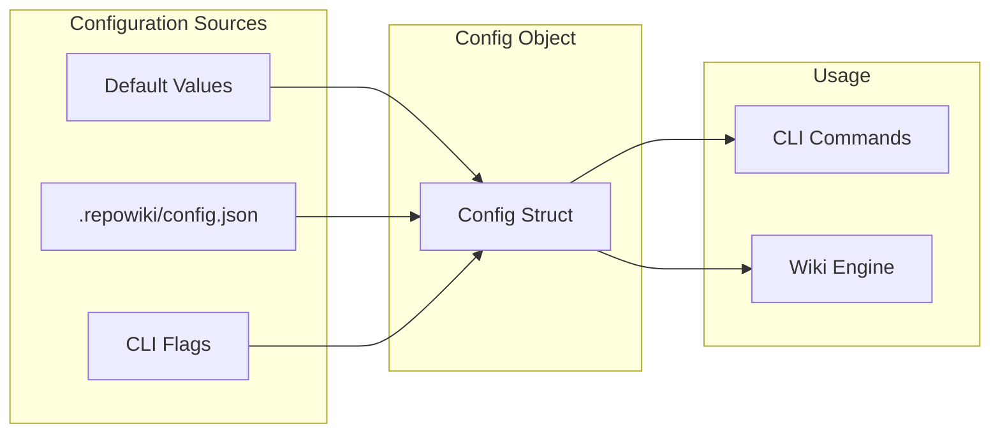
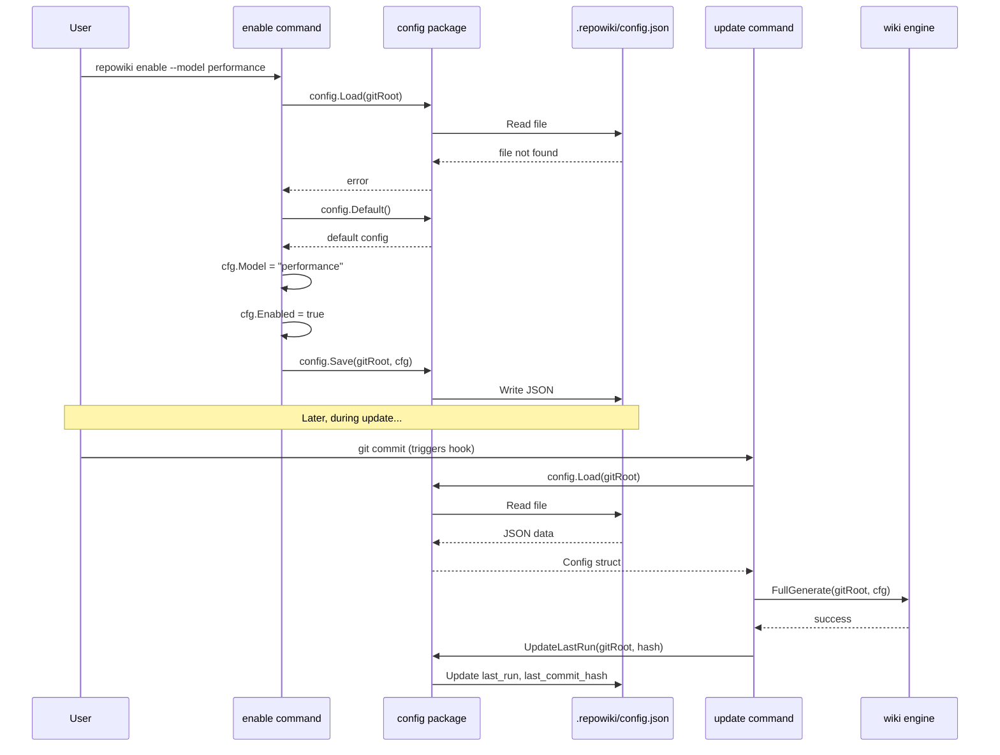

# Configuration System

<cite>
Source files referenced:
- [internal/config/config.go](/to/internal/config/config.go)
- [.repowiki/config.json](/to/.repowiki/config.json)
- [cmd/repowiki/enable.go](/to/cmd/repowiki/enable.go)
</cite>

## Table of Contents

- [Overview](#overview)
- [Configuration File](#configuration-file)
- [Configuration Structure](#configuration-structure)
- [Default Configuration](#default-configuration)
- [Configuration Operations](#configuration-operations)
- [Runtime Updates](#runtime-updates)

## Overview

The configuration system provides persistent storage for repowiki settings. Configuration is stored in JSON format at `.repowiki/config.json` and managed through the `internal/config` package.



## Configuration File

**Location**: `.repowiki/config.json`

**Example**:

```json
{
  "enabled": true,
  "qodercli_path": "qodercli",
  "model": "auto",
  "max_turns": 50,
  "language": "en",
  "auto_commit": true,
  "commit_prefix": "[repowiki]",
  "excluded_paths": [
    ".qoder/repowiki/",
    ".repowiki/",
    "node_modules/",
    "vendor/",
    ".git/"
  ],
  "wiki_path": ".qoder/repowiki",
  "full_generate_threshold": 20,
  "last_run": "2026-02-19T15:30:00Z",
  "last_commit_hash": "abc123def456"
}
```

## Configuration Structure

**File**: `internal/config/config.go`

```go
type Config struct {
    Enabled               bool     `json:"enabled"`
    QoderCLIPath          string   `json:"qodercli_path"`
    Model                 string   `json:"model"`
    MaxTurns              int      `json:"max_turns"`
    Language              string   `json:"language"`
    AutoCommit            bool     `json:"auto_commit"`
    CommitPrefix          string   `json:"commit_prefix"`
    ExcludedPaths         []string `json:"excluded_paths"`
    WikiPath              string   `json:"wiki_path"`
    FullGenerateThreshold int      `json:"full_generate_threshold"`
    LastRun               string   `json:"last_run,omitempty"`
    LastCommitHash        string   `json:"last_commit_hash,omitempty"`
}
```

### Field Descriptions

| Field | Type | Description |
|-------|------|-------------|
| `enabled` | `bool` | Whether repowiki is active in this repository |
| `qodercli_path` | `string` | Path to the Qoder CLI binary |
| `model` | `string` | AI model level (auto, efficient, performance, ultimate) |
| `max_turns` | `int` | Maximum number of AI interaction turns |
| `language` | `string` | Language code for wiki generation (e.g., "en") |
| `auto_commit` | `bool` | Whether to automatically commit wiki changes |
| `commit_prefix` | `string` | Prefix for wiki commit messages |
| `excluded_paths` | `[]string` | Paths to exclude from change detection |
| `wiki_path` | `string` | Output directory for generated wiki |
| `full_generate_threshold` | `int` | File change threshold for full regeneration |
| `last_run` | `string` | ISO 8601 timestamp of last wiki generation |
| `last_commit_hash` | `string` | Git hash of last processed commit |

## Default Configuration

```go
func Default() *Config {
    return &Config{
        Enabled:      true,
        QoderCLIPath: "qodercli",
        Model:        "auto",
        MaxTurns:     50,
        Language:     "en",
        AutoCommit:   true,
        CommitPrefix: "[repowiki]",
        ExcludedPaths: []string{
            ".qoder/repowiki/",
            ".repowiki/",
            "node_modules/",
            "vendor/",
            ".git/",
        },
        WikiPath:              ".qoder/repowiki",
        FullGenerateThreshold: 20,
    }
}
```

### Default Excluded Paths

| Path | Reason |
|------|--------|
| `.qoder/repowiki/` | Wiki output directory (avoid self-triggering) |
| `.repowiki/` | Configuration and logs |
| `node_modules/` | Node.js dependencies |
| `vendor/` | Go vendor directory |
| `.git/` | Git internals |

## Configuration Operations

### Path Helpers

```go
const (
    ConfigDir  = ".repowiki"
    ConfigFile = "config.json"
    LogDir     = "logs"
)

// Returns /path/to/repo/.repowiki
func Dir(gitRoot string) string {
    return filepath.Join(gitRoot, ConfigDir)
}

// Returns /path/to/repo/.repowiki/config.json
func Path(gitRoot string) string {
    return filepath.Join(Dir(gitRoot), ConfigFile)
}

// Returns /path/to/repo/.repowiki/logs
func LogPath(gitRoot string) string {
    return filepath.Join(Dir(gitRoot), LogDir)
}
```

### Loading Configuration

```go
func Load(gitRoot string) (*Config, error) {
    data, err := os.ReadFile(Path(gitRoot))
    if err != nil {
        return nil, fmt.Errorf("failed to read config: %w", err)
    }

    var cfg Config
    if err := json.Unmarshal(data, &cfg); err != nil {
        return nil, fmt.Errorf("failed to parse config: %w", err)
    }

    return &cfg, nil
}
```

### Saving Configuration

```go
func Save(gitRoot string, cfg *Config) error {
    // Ensure directory exists
    if err := os.MkdirAll(Dir(gitRoot), 0755); err != nil {
        return fmt.Errorf("failed to create config dir: %w", err)
    }

    // Marshal with indentation
    data, err := json.MarshalIndent(cfg, "", "  ")
    if err != nil {
        return fmt.Errorf("failed to marshal config: %w", err)
    }

    // Add trailing newline
    data = append(data, '\n')

    return os.WriteFile(Path(gitRoot), data, 0644)
}
```

### Usage in Commands

```go
// cmd/repowiki/enable.go
func handleEnable(args []string) {
    // ...
    cfg, err := config.Load(gitRoot)
    if err != nil {
        cfg = config.Default()  // Use defaults if no config exists
    }

    // Apply CLI flag overrides
    if *qoderPath != "" {
        cfg.QoderCLIPath = *qoderPath
    }
    if *model != "" {
        cfg.Model = *model
    }
    if *noAutoCommit {
        cfg.AutoCommit = false
    }
    cfg.Enabled = true

    // Save updated config
    config.Save(gitRoot, cfg)
}
```

## Runtime Updates

### Last Run Tracking

The configuration is updated after each successful wiki generation:

```go
func UpdateLastRun(gitRoot string, commitHash string) error {
    cfg, err := Load(gitRoot)
    if err != nil {
        return err
    }

    cfg.LastRun = time.Now().UTC().Format(time.RFC3339)
    cfg.LastCommitHash = commitHash

    return Save(gitRoot, cfg)
}
```

### Usage in Update Flow

```go
// cmd/repowiki/update.go
func handleUpdate(args []string) {
    // ...
    // Get changed files since last run
    if cfg.LastCommitHash != "" && cfg.LastCommitHash != hash {
        changedFiles, err = git.ChangedFilesSince(gitRoot, cfg.LastCommitHash)
    }

    // ... perform update ...

    // Update tracking
    config.UpdateLastRun(gitRoot, hash)
}
```

### Disable Updates

When disabling, the config is updated but preserved:

```go
// cmd/repowiki/disable.go
func handleDisable(args []string) {
    // ...
    cfg, err := config.Load(gitRoot)
    if err == nil {
        cfg.Enabled = false
        config.Save(gitRoot, cfg)
    }
}
```

## Configuration Flow


