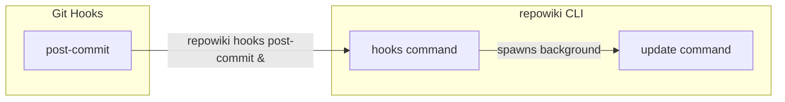
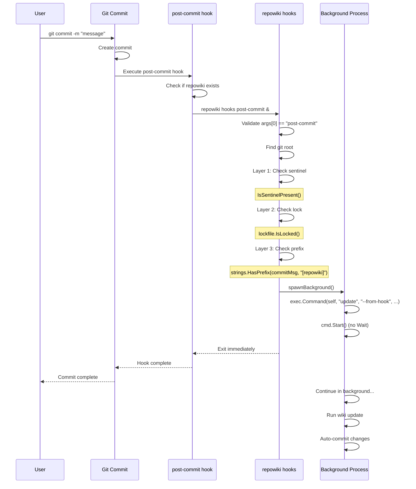

# Hook Management

<cite>
Source files referenced:
- [internal/hook/hook.go](/to/internal/hook/hook.go)
- [cmd/repowiki/enable.go](/to/cmd/repowiki/enable.go)
- [cmd/repowiki/disable.go](/to/cmd/repowiki/disable.go)
- [cmd/repowiki/hooks.go](/to/cmd/repowiki/hooks.go)
</cite>

## Table of Contents

- [Overview](#overview)
- [Hook Script Structure](#hook-script-structure)
- [Installation](#installation)
- [Uninstallation](#uninstallation)
- [Status Checking](#status-checking)
- [Hook Execution Flow](#hook-execution-flow)

## Overview

repowiki uses Git's post-commit hook to automatically trigger wiki updates after every commit. The hook is installed during `repowiki enable` and removed during `repowiki disable`.



## Hook Script Structure

The hook script is wrapped in markers for safe installation and removal:

```go
const (
    markerStart = "# repowiki hook start"
    markerEnd   = "# repowiki hook end"
)

func script() string {
    return markerStart + `
# Auto-generated by repowiki — do not edit this block
if command -v repowiki >/dev/null 2>&1; then
  repowiki hooks post-commit &
fi
` + markerEnd
}
```

### Generated Hook Content

```sh
#!/bin/sh

# repowiki hook start
# Auto-generated by repowiki — do not edit this block
if command -v repowiki >/dev/null 2>&1; then
  repowiki hooks post-commit &
fi
# repowiki hook end
```

### Key Features

- **Marker-based**: Start and end markers allow safe modification
- **Existence check**: Verifies `repowiki` is available before running
- **Background execution**: The `&` ensures the hook doesn't block the terminal
- **Non-destructive**: Preserves existing hook content

## Installation

**File**: `internal/hook/hook.go`

### Install Function

```go
func Install(gitRoot string, force bool) error {
    hp := hookPath(gitRoot)

    // Ensure hooks directory exists
    if err := os.MkdirAll(filepath.Dir(hp), 0755); err != nil {
        return fmt.Errorf("failed to create hooks dir: %w", err)
    }

    // Read existing hook file if present
    data, err := os.ReadFile(hp)
    if err == nil {
        // Hook file exists - append or replace
        content := string(data)
        if strings.Contains(content, markerStart) {
            if !force {
                return fmt.Errorf("repowiki hook already installed; use --force to reinstall")
            }
            content = removeBlock(content)
        }
        content = strings.TrimRight(content, "\n") + "\n\n" + script() + "\n"
        return os.WriteFile(hp, []byte(content), 0755)
    }

    // Create new hook file with shebang
    content := "#!/bin/sh\n\n" + script() + "\n"
    return os.WriteFile(hp, []byte(content), 0755)
}
```

### Installation Scenarios

#### Fresh Installation

```
.git/hooks/post-commit (new file)
├── #!/bin/sh
├── # repowiki hook start
├── # Auto-generated by repowiki
├── repowiki hooks post-commit &
└── # repowiki hook end
```

#### Appending to Existing Hook

```
.git/hooks/post-commit (existing file)
├── #!/bin/sh
├── # Existing user hooks...
├── echo "Custom notification"
├── # repowiki hook start
├── # Auto-generated by repowiki
├── repowiki hooks post-commit &
└── # repowiki hook end
```

#### Force Reinstall

```bash
repowiki enable --force
```

Removes existing repowiki block and appends fresh one.

## Uninstallation

**File**: `internal/hook/hook.go`

### Uninstall Function

```go
func Uninstall(gitRoot string) error {
    hp := hookPath(gitRoot)
    data, err := os.ReadFile(hp)
    if err != nil {
        return nil // No hook file, nothing to do
    }

    content := removeBlock(string(data))
    trimmed := strings.TrimSpace(content)

    // If only shebang remains, remove the file entirely
    if trimmed == "#!/bin/sh" || trimmed == "" {
        return os.Remove(hp)
    }

    // Otherwise, write back without repowiki block
    return os.WriteFile(hp, []byte(content), 0755)
}
```

### Block Removal

```go
func removeBlock(content string) string {
    startIdx := strings.Index(content, markerStart)
    endIdx := strings.Index(content, markerEnd)
    if startIdx == -1 || endIdx == -1 {
        return content
    }
    endIdx += len(markerEnd)
    // Also remove trailing newline after the block
    if endIdx < len(content) && content[endIdx] == '\n' {
        endIdx++
    }
    return content[:startIdx] + content[endIdx:]
}
```

### Uninstallation Scenarios

#### Only repowiki Hook

Before:
```sh
#!/bin/sh

# repowiki hook start
...
# repowiki hook end
```

After: File is deleted entirely.

#### Mixed with User Hooks

Before:
```sh
#!/bin/sh

echo "Running custom hook"

# repowiki hook start
...
# repowiki hook end
```

After:
```sh
#!/bin/sh

echo "Running custom hook"
```

## Status Checking

**File**: `internal/hook/hook.go`

```go
func IsInstalled(gitRoot string) bool {
    data, err := os.ReadFile(hookPath(gitRoot))
    if err != nil {
        return false
    }
    return strings.Contains(string(data), markerStart)
}
```

Used by the `status` command:

```go
// cmd/repowiki/status.go
if hook.IsInstalled(gitRoot) {
    fmt.Printf("  Hook:         installed (.git/hooks/post-commit)\n")
} else {
    fmt.Printf("  Hook:         not installed\n")
}
```

## Hook Execution Flow

**File**: `cmd/repowiki/hooks.go`

When a user runs `git commit`, the hook executes:



### Background Process Spawning

```go
func spawnBackground(gitRoot string, commitHash string) {
    self, err := os.Executable()
    if err != nil {
        return
    }

    logDir := config.LogPath(gitRoot)
    os.MkdirAll(logDir, 0755)

    logFile, err := os.OpenFile(
        fmt.Sprintf("%s/hook.log", logDir),
        os.O_CREATE|os.O_APPEND|os.O_WRONLY,
        0644,
    )
    if err != nil {
        return
    }

    cmd := exec.Command(self, "update", "--from-hook", "--commit", commitHash)
    cmd.Dir = gitRoot
    cmd.Stdout = logFile
    cmd.Stderr = logFile
    cmd.SysProcAttr = &syscall.SysProcAttr{Setsid: true}  // Detach from parent

    cmd.Start()
    // Do NOT call cmd.Wait() — let it run independently
    logFile.Close()
}
```

### Key Design Decisions

1. **Background execution**: The `&` in the hook and `Setsid: true` in Go ensure the user's terminal is never blocked.

2. **Detached process**: The background process continues even if the parent exits.

3. **Logging**: All output is redirected to `.repowiki/logs/hook.log` for debugging.

4. **Silent failures**: Hook failures don't affect the git commit operation.

5. **Loop prevention**: Multiple layers prevent wiki commits from triggering themselves (see [Loop Prevention](Loop%20Prevention.md)).
